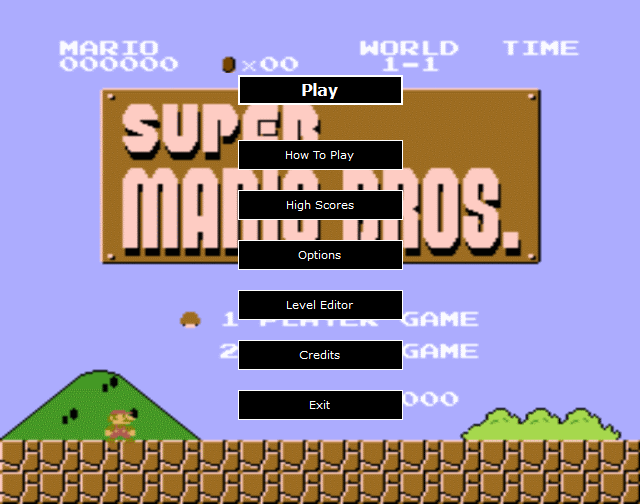
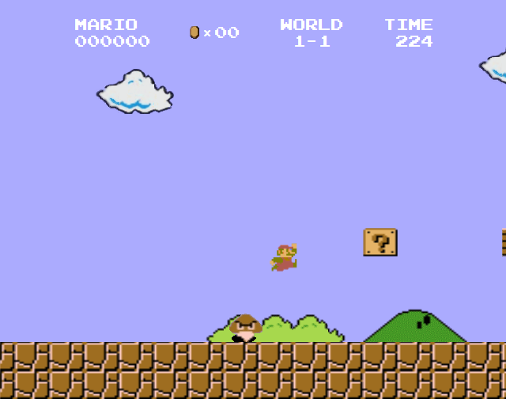
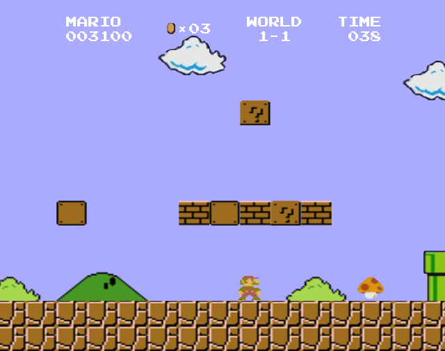
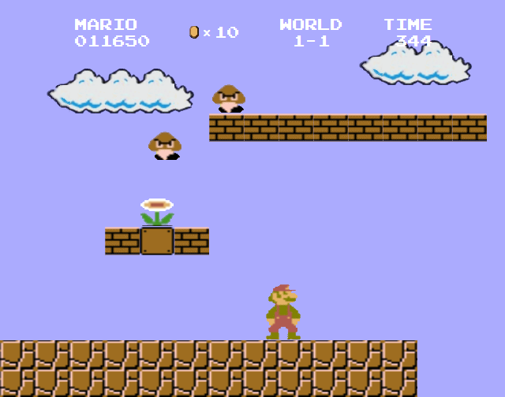

# SuperMario.NET

A 'Super Mario Bros' (NES) game clon, developed in VB.NET & GDI+  

There are some bugs with collision detection, which I hope to solve in a next release.  

&nbsp;

### Screenshots

| Welcome Screen                            | Game                                      |
|-------------------------------------------|-------------------------------------------|
|      |      |

| Game                                      | Game                                      |
|-------------------------------------------|-------------------------------------------|
|      |      |

&nbsp;

### Version History

v1.0 (2021.05.12) - Initial release.  

&nbsp;

This is the first public release of this project.  
Developed in 2010.11 for subject 'Programación III', at Universidad Tecnológica Nacional (UTN), Buenos Aires, Argentina.  
Enjoy!

This source code is licensed under GPL v3.0  
Please send to me your feedback about this game: andres.garcia.alves@gmail.com
